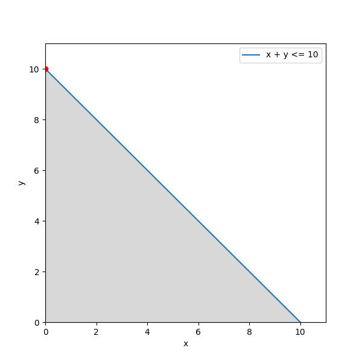
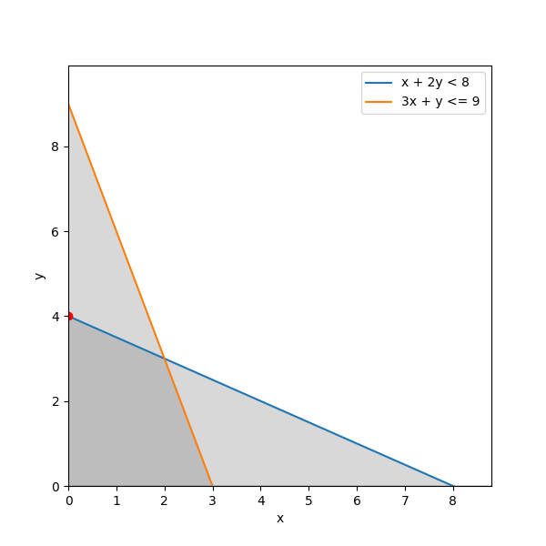

# Optimization Workbook

Welcome to my Data Science project focusing on real-world business applications of mathematical optimization.
Over the coming months, I will explore various optimization techniques and apply them to practical scenarios on this repo.

## Linear Optimization

Linear optimization involves finding the best outcome in a mathematical model whose requirements are represented by linear relationships. Below are some examples from this workbook:

### Problem: Maximize Z = 3x + 4y
**Subject to:** \( x + y <= 10 \) and \( x, y >= 0 \)

### Problem: Maximize Z = 2x + 3y
**Subject to:** \( x + 2y <= 8 \) and \( 3x + y <= 9 \) and \( x, y >= 0 \)

